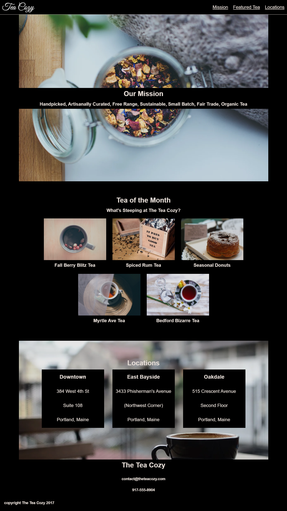

# Codecademy Tea Cozy Flexbox Layout
<https://jarrettd5309.github.io/tea-cozy/> \
Version 1.0 \
Original Deployment Date - Oct 09, 2020\
By Jarrett Dougherty

### Spec Sheet from Codecademy
<kdb></kdb>

### Screen Shot of My Project
<kdb></kdb>

## Description
This is a project from Codecademy focusing on flexbox CSS skills. The goal of this assignment is to exactly copy a website design from a spec sheet using only HTML and CSS. I have taken the project one step further by also incorporating a responsive design.

## Technologies Used
* HTML
* CSS